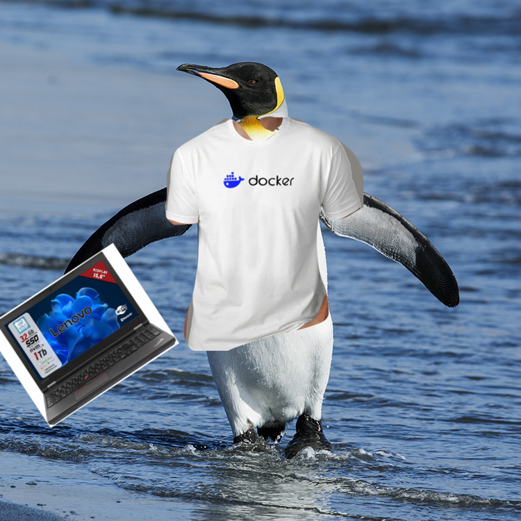

# 🐧 PenguinOps Docs

Benvenuto nella documentazione ufficiale del laboratorio **PenguinOps**.

Qui imparerai come deployare container Docker… guidato da una colonia di pinguini altamente qualificati.

## 🚀 Obiettivi

* Capire le basi di Docker
* Costruire immagini container
* Eseguire deploy in ambienti controllati
* Sopravvivere al giudizio silenzioso dei pinguini

## 📚 Struttura

* [Setup dell'ambiente](setup.md)
* [Deploy avanzato](deploy.md)

## 🧊 Nota importante

I pinguini:

* odiano i container mal configurati
* apprezzano i volumi persistenti
* non perdonano `latest` nei tag delle immagini

Buona fortuna.
