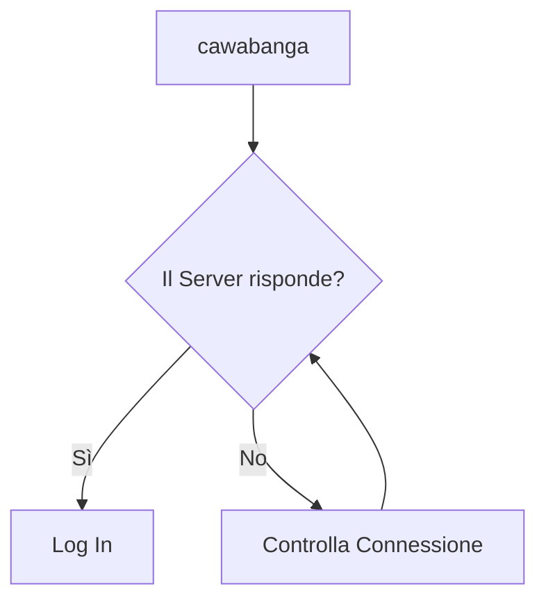

# Bella documentazione

Clicca qui per dettagli [Clicca qui](https://www.youtube.com/watch?v=dQw4w9WgXcQ).

## Commands

* `mkdocs new [dir-name]` - Create a new project.
* `mkdocs serve` - Start the live-reloading docs server.
* `mkdocs build` - Build the documentation site.
* `mkdocs -h` - Print help message and exit.

## Project layout

    mkdocs.yml    # The configuration file.
    docs/
        index.md  # The documentation homepage.
        ...       # Other markdown pages, images and other files.

# Architettura sito

ora si reloadda
